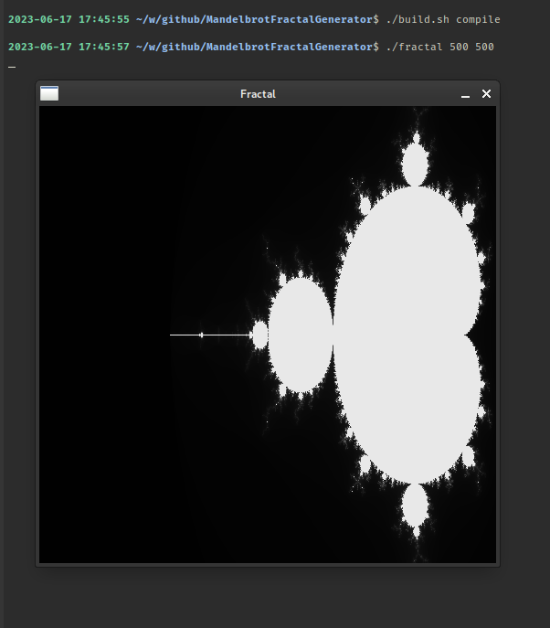
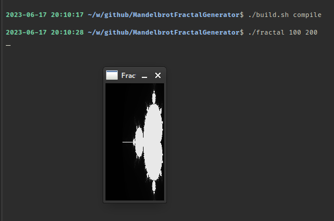
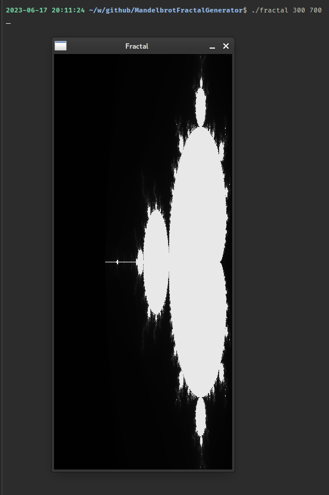
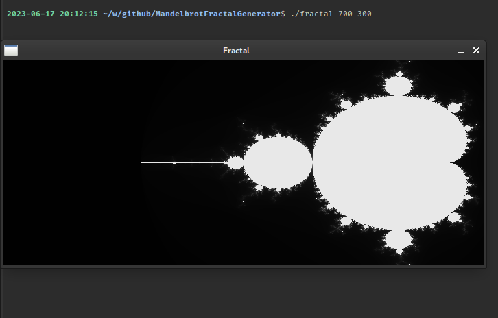
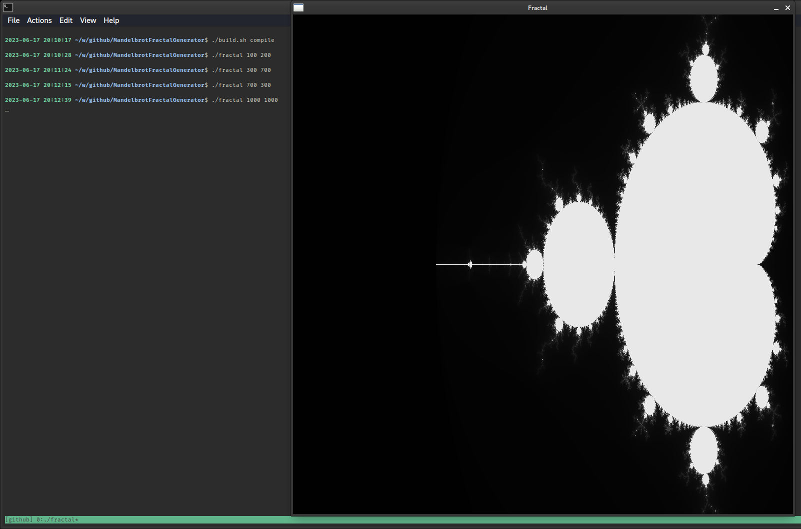
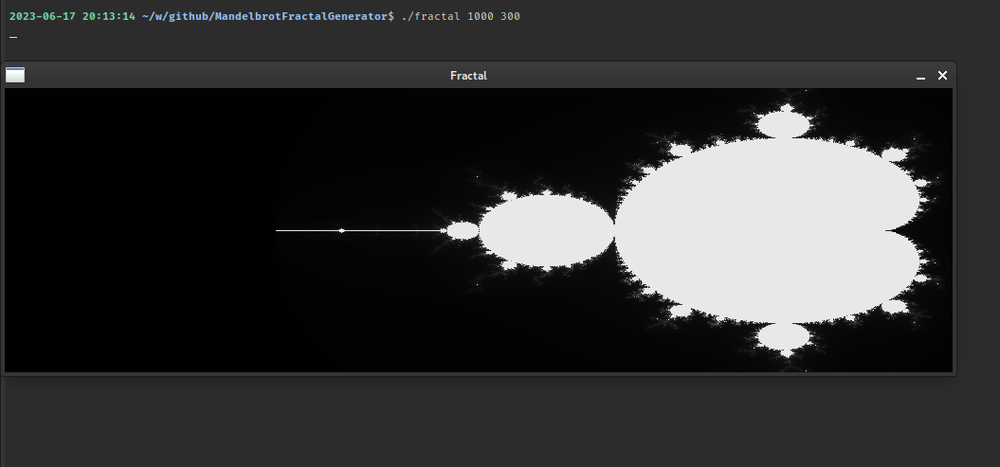
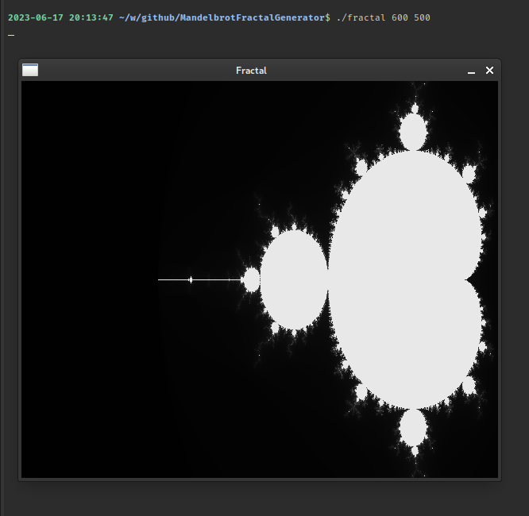

# Mandelbrot Fractal Generator

This is a C program that generates fractal images using the Mandelbrot set. The program allows users to zoom in and out of the image and change its color scheme.










## Features

- Generate fractal images using the Mandelbrot set
- Zoom in and out of the image using the mouse or keyboard

## Requirements

- C compiler (GCC or Clang recommended)
- SDL2 library (for graphics)

## Usage

To build the program, run:

```bash
chmod +x build.sh
./build.sh compile
```

To run the program, use the following command:

```bash
./fractal [width] [height]
```

Replace [width] and [height] with the desired width and height of the image in pixels.

The fractal window will open, displaying the default Mandelbrot set. You can use the mouse or keyboard to zoom in and out of the image and change its color scheme.

## Keyboard Shortcuts

- `+`: Zoom in
- `-`: Zoom out
- `s`: Save the current image to a file
- `q`: Quit the program

## Mouse Controls

- Left-click: Zoom in at the clicked position
- Right-click: Zoom out at the clicked position
- Middle-click: Reset the zoom level and color scheme

## Notes

- The program uses a simple implementation of the Mandelbrot set algorithm.
- The graphics are rendered using the SDL2 library.
- The code is well-organized and commented for readability.

## Example

Here is an example of how to use the program:

- Build and run the program:

```bash
./build.sh compile
./fractal 800 600
```

- Use the mouse to zoom in and out of the image.

- Press the s key to save the current image to a file.

- Press the q key to quit the program.

I hope this description helps you understand the Mandelbrot fractal generator project and its features. If you have any questions, feel free to contact me.

## Authors

- Maximilian Edison
- Max Base

Copyright 2023, Max Base
